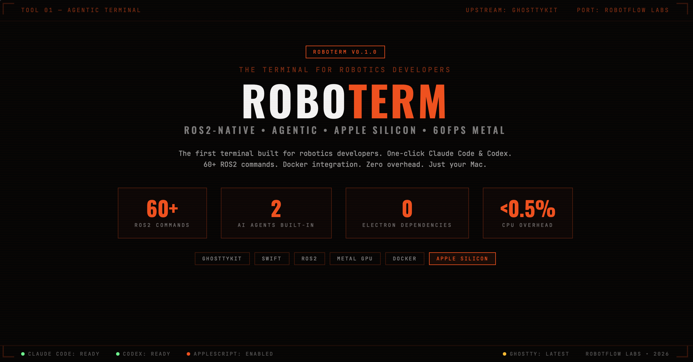

<p align="center">
  
</p>

<p align="center">
  <strong>The first ROS2-native agentic terminal for Apple Silicon.</strong><br>
  Built by <a href="https://robotflowlabs.com">RobotFlow Labs</a> &bull; Powered by <a href="https://github.com/ghostty-org/ghostty">GhosttyKit</a> (Metal GPU)
</p>

<p align="center">
  <a href="#features">Features</a> &bull;
  <a href="#build">Build</a> &bull;
  <a href="#architecture">Architecture</a> &bull;
  <a href="#keyboard-shortcuts">Shortcuts</a> &bull;
  <a href="#license">License</a>
</p>

---

## Why ROBOTERM?

Robotics developers on macOS suffer from **fragmented tooling** — jumping between `ros2` CLI, rqt, RViz, Foxglove, Docker, and SSH sessions. ROBOTERM unifies everything into one terminal with:

- **One-click AI agents** (Claude Code, Codex) for agentic development
- **60+ ROS2 commands** accessible from menus and right-click
- **Zero overhead** — native Swift on GhosttyKit, <0.5% CPU over plain Ghostty
- **Industrial Cyberpunk design** matching the RobotFlow Labs ecosystem

```
ROBOTERM (Swift, ~2500 lines)
    |
    +-- Chrome Layer (our code)
    |   +-- Agent launcher bar (Claude Code, Codex)
    |   +-- Robotics menu (60+ ROS2 commands)
    |   +-- Status bar (CPU/MEM, git, ROS2 domain, clock)
    |   +-- Workspace sidebar (Industrial Cyberpunk design)
    |   +-- AppleScript support (full SDEF dictionary)
    |   +-- Session persistence
    |
    +-- GhosttyKit.xcframework (upstream, never modified)
        +-- Metal GPU-accelerated terminal renderer
        +-- VT100/xterm parser
        +-- 43 action callbacks
```

## Features

### Agent Launcher Bar
One-click launch for AI coding agents directly from the toolbar:
- **Claude Code** — Anthropic's CLI agent
- **Codex** — OpenAI's CLI agent

### ROS2 Integration (60+ commands)

| Category | Commands |
|----------|----------|
| **Introspect** | nodes, topics, services, actions, params, interfaces, rqt_graph |
| **Diagnostics** | doctor, daemon, multicast, wtf, topic hz/delay |
| **Transforms** | view_frames, tf2_echo, tf2_monitor |
| **Launch & Build** | ros2 launch/run, colcon build/test, --symlink-install |
| **Bag Recording** | record all, record select, play, info |
| **Simulation** | Gazebo, RViz2, rqt, MuJoCo, Isaac Sim |

### Right-Click Context Menu
- Copy, Paste, Split (Right/Left/Down/Up), Reset Terminal, Select All
- **ROS2 submenu**: nodes, topics, services, doctor, TF tree, topic Hz
- **Launch Agent submenu**: Claude Code, Codex

### CLI Tools (14 commands)
Add to your `~/.bashrc` or `~/.zshrc`:
```bash
# Auto-source ROBOTERM tools when running inside ROBOTERM
[ -n "$ROBOTERM" ] && [ -f "$ROBOTERM_TOOLS" ] && source "$ROBOTERM_TOOLS"
```

Then use `rt` commands:
```
rt init        — Auto-detect & source ROS2 workspace
rt nodes       — Live node dashboard
rt topics      — Topic monitor with types
rt services    — Service list with types
rt params      — Parameter browser
rt doctor      — System diagnostics (ROS2, DDS, Docker, hardware)
rt tf          — Transform tree (view_frames, echo, monitor)
rt build       — Smart colcon build with auto-source
rt bag         — Bag management (list, info, record, play)
rt hz          — Topic frequency monitor
rt echo        — Pretty topic echo
rt launch      — Enhanced ros2 launch
rt dds         — DDS configuration & diagnostics
rt docker      — Docker helpers (ps, up, down, logs, shell)
```

### Status Bar
Live system info with zero overhead:
- CPU/MEM via mach APIs (no subprocess spawning)
- Git branch from filesystem read (no `git` call)
- ROS2 distro & domain ID from env vars
- Clock

### Docker Integration
- `docker compose ps / up / down / logs`
- `docker ps -a`, `docker images`

### Hardware
- Camera, LiDAR, IMU, Gamepad status via `ros2 topic echo`
- USB device listing (`system_profiler SPUSBDataType`)
- Serial port discovery (`/dev/tty.*`, `/dev/cu.*`)
- SSH to robot

### ANIMA Suite
- Module status, compile, plug
- Docker compose integration for ANIMA modules

### AppleScript
Full Cocoa scripting support with SDEF dictionary:
```applescript
tell application "ROBOTERM"
    set w to (new window)
    input text "ros2 topic list" to focused terminal of selected tab of w
end tell
```

### Design
Industrial Cyberpunk theme matching [RobotFlow Labs](https://robotflowlabs.com):

| Token | Value | Usage |
|-------|-------|-------|
| `#FF3B00` | Orange | Accent, selected state, cursor |
| `#050505` | Void Black | Terminal background |
| `#080808` | Near Black | Sidebar background |
| `#00FF88` | Green | Status indicators, Codex |
| `#1A1A1A` | Dark Gray | Panels, elevated surfaces |

- JetBrains Mono font throughout
- No rounded corners — sharp, industrial
- Monospaced uppercase labels with letter-spacing

## Build

```bash
# Prerequisites
brew install xcodegen
# Ghostty.app must be installed (for GhosttyKit resources)

# Build
git clone https://github.com/RobotFlow-Labs/roboterm.git
cd roboterm
xcodegen generate
xcodebuild -project roboterm.xcodeproj -scheme roboterm -configuration Debug build

# Run
open ~/Library/Developer/Xcode/DerivedData/roboterm-*/Build/Products/Debug/ROBOTERM.app
```

## Architecture

ROBOTERM is a **thin shell** over Ghostty's `GhosttyKit.xcframework`. We never modify the terminal engine — our code only touches the chrome (sidebar, tabs, status bar, menus, agent bar).

**Upstream tracking**: Ghostty submodule pinned to releases. When new versions ship, we pull and rebuild. Our code stays separate.

**Performance budget**:

| Component | CPU Impact | Update Frequency |
|-----------|-----------|-----------------|
| Terminal rendering | 0% (Ghostty Metal) | 60fps GPU |
| Status bar | <0.1% | 10-second timer |
| Git branch | 0% | On directory change |
| ROS2 env vars | 0% | On tab switch |
| CPU/MEM monitor | <0.1% | 10-second mach API |

**Total overhead vs plain Ghostty: <0.5% CPU.**

## Keyboard Shortcuts

| Shortcut | Action |
|----------|--------|
| `Cmd+T` | New Tab |
| `Cmd+W` | Close Tab |
| `Cmd+N` | New Window |
| `Cmd+D` | Split Right |
| `Cmd+Shift+D` | Split Down |
| `Cmd+Opt+]` | Next Pane |
| `Cmd+Opt+[` | Previous Pane |
| `Cmd+Shift+}` | Next Tab |
| `Cmd+Shift+{` | Previous Tab |
| `Cmd+1-9` | Jump to Tab |
| `Cmd+Shift+L` | ros2 launch |
| `Cmd+Shift+B` | colcon build |

## Roadmap

- [ ] ROS2 node dashboard (live health monitoring)
- [ ] Topic monitor (real-time Hz, bandwidth, message preview)
- [ ] DDS inspector (domain topology)
- [ ] TF2 debugging panel
- [ ] Bag file management
- [ ] Sensor visualization (inline camera/LiDAR preview)
- [ ] SSH robot profiles
- [ ] Foxglove export integration

## License

Apache 2.0

## Credits

- Terminal engine: [Ghostty](https://github.com/ghostty-org/ghostty) by Mitchell Hashimoto
- Original chrome concept: [ghast](https://github.com/aidenybai/ghast)
- Built by [RobotFlow Labs](https://robotflowlabs.com) / [AIFLOW LABS](https://aiflowlabs.io)
